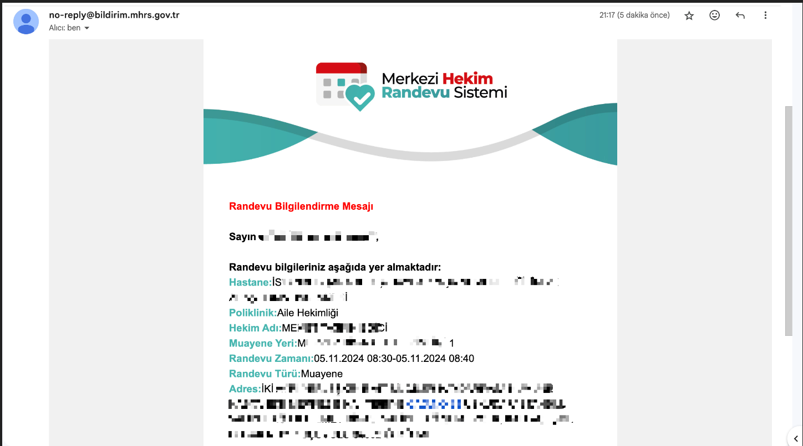

# MHRS Appointment CLI

Brief description of your project.

## Table of Contents

- [Prerequisites](#prerequisites)
- [Set Environment Variables](#set-environment-variables)
- [Installation](#installation)
- [Usage](#usage)
- [Notification](#notification)
- [Result](#result)
- [Features of Project](#features)
- [Sorumluluk Reddi (TR)](#sorumluluk-reddi-tr)
- [Disclaimer (EN)](#disclaimer-en)


---

## Prerequisites

- **Make** (for running `make` commands)
- **Docker** (for building and running the Docker container)

## Set Environment Variables
You should fill the `.env.example` file before the run.

## Installation

1. Clone the repository:

   ```bash
   git clone https://github.com/anilonayy/mhrs-appointment-cli
   cd mhrs-appointment-cli
    ```
   
2. Build the project:
    
   ```bash
   make build
   ```
3. Run the project:
    
   ```bash
   make run
   ```
   
## Usage


## Notification
- You will receive a notification when the appointment is available.


## Result
- You will see the available appointments.


## Features of Project
With this project, you can experience a real appointment booking process by providing filters through the CLI and having it check for an available appointment every 15 minutes. The advantage of this project is that it operates independently within a Docker container. Once an appointment is found, the process terminates. You will be notified with an appointment confirmation email sent by the relevant organization.


## Sorumluluk Reddi (TR)

Bu proje, sadece eğitim amaçlı olarak geliştirilmiştir. Proje, yazılım geliştirme tekniklerini öğretmek ve uygulamak amacıyla oluşturulmuş bir örnek çalışmadır. Projenin geliştiricisi olarak, bu yazılımın kullanımından doğacak herhangi bir sonuç veya zarar için sorumluluk kabul etmiyoruz.

- Kullanıcı, projeyi kullanmadan önce gerekli yasal izinleri almakla ve ilgili tüm yasal düzenlemelere uymakla yükümlüdür. Projeyi kullanarak, tüm sorumluluğu ve riski kabul etmiş sayılırsınız. Bu proje, MHRS sistemine erişim sağlayan herhangi bir bilgi veya kimlik doğrulama verisi içermez. Tüm endpoint bilgileri .env dosyasına yerleştirilmiştir ve kullanıcı tarafından manuel olarak doldurulması gerekmektedir.

- Bu projeyi kullanırken dikkat edilmesi gerekenler:
    - MHRS veya başka bir sağlık kuruluşunun sistemine otomatik olarak erişim sağlamak yasal kısıtlamalara tabi olabilir. Herhangi bir şekilde resmi sistemlere zarar verecek veya bu sistemleri kötüye kullanacak şekilde kullanılması yasaktır.
    - Proje, kullanıcı tarafından sağlanacak veriler ile çalışacak şekilde yapılandırılmıştır. Veri gizliliği ve güvenliği tamamen kullanıcının sorumluluğundadır.
    - Proje, herhangi bir kuruma zarar verecek veya sistem yükünü artıracak şekilde kullanılmamalıdır.

Bu yazılımı kullanarak, yukarıdaki tüm maddeleri anladığınızı ve kabul ettiğinizi beyan etmiş olursunuz. Aksi durumlarda oluşabilecek yasal ve teknik sorunlardan geliştirici sorumlu tutulamaz.

---

## Disclaimer (EN)

This project is developed **for educational purposes only** and is not affiliated in any way with **any official healthcare system or MHRS** (Central Physician Appointment System). The project was created as a sample to demonstrate and apply software development techniques. As the developer of this software, we **do not assume any responsibility** for any consequences or damages arising from the use of this software.

- The user is solely responsible for obtaining the necessary legal permissions and for complying with all relevant legal regulations before using the project. By using this project, you **accept all risks and responsibilities** associated with it. This project does not include any data or authentication information to access the MHRS system. **All endpoint information is placed in a .env file and must be manually filled in by the user.**

- Important points to consider when using this project:
    - Accessing the MHRS or any other healthcare system automatically may be subject to legal restrictions. **It is strictly prohibited to use this project in any way that harms or abuses official systems.**
    - The project is configured to work with user-provided data. **Data privacy and security are solely the responsibility of the user.**
    - This project should not be used in a manner that could harm any institution or increase system load.

By using this software, you acknowledge and accept all of the above conditions. The developer cannot be held responsible for any legal or technical issues that may arise otherwise.

--- 

If you want to use and actually develop the project, you will need to debug the endpoints yourself.
You can get information on debugging methods for how to obtain them.